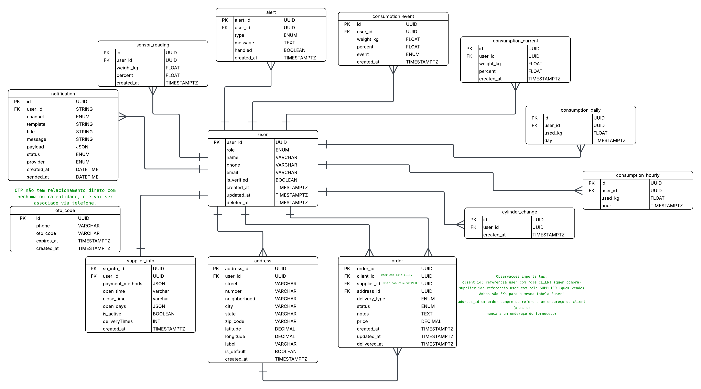
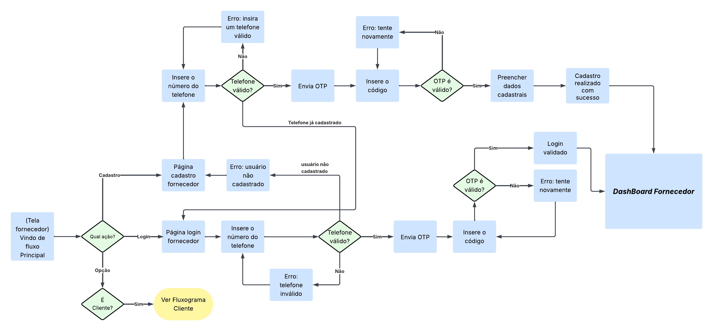

# Documentação Técnica — BugBusters Gas Control API (Back-end)

> Projeto acadêmico (Back-end) — API REST para monitoramento e gestão de GLP, com autenticação por OTP, pedidos de recarga, histórico de consumo, alertas e sensor simulado.

---

## 1. Objetivo do documento

Este documento tem como objetivo registrar **como o sistema funciona por dentro** (regras, dados, rotas, integrações e manutenção), garantindo que futuras pessoas consigam:

- Executar o projeto localmente
- Entender as regras de negócio
- Testar os endpoints
- Evoluir ou corrigir o sistema com segurança

> Conforme orientação, esta documentação é voltada ao **Back-end** (regras, dados, processos e integrações). **Front-end não se aplica** a este projeto.  
> Referência do escopo e objetivo do sistema: SRS / requisitos do projeto.

---

## 2. Requisitos

### 2.1 Requisitos Funcionais (RF)

Baseado na especificação SRS do projeto, a API cobre (MVP):

- RF-01 / RF-02 / RF-03: Cadastro e autenticação de cliente/fornecedor via telefone (OTP + JWT)
- RF-04 / RF-05: Solicitação de GLP com modalidade **DELIVERY** ou **PICKUP**
- RF-08: Registro de leituras do sensor simulado
- RF-09 / RF-10: Detecção de consumo excessivo e possível vazamento
- RF-11: Notificações (no MVP: mock, preparado para WhatsApp/Push)
- RF-13 / RF-14: Histórico de consumo e exportação em PDF
- RF-15: Dados operacionais do fornecedor (pagamentos, horários, dias etc.)

> Lista detalhada RF/RNF/RN: documento de requisitos (SRS) software-requirements.

### 2.2 Requisitos Não Funcionais (RNF) (planejado/esperado)

- API REST com Node.js + TypeScript
- Banco PostgreSQL via Prisma
- Tokens JWT para rotas protegidas
- Variáveis sensíveis em `.env`
- Arquitetura em camadas (Controllers / Services / Repositories)
- Suporte a múltiplos endereços por usuário

> Observação: itens como “criptografia de telefone/endereço” e “HTTPS obrigatório” são requisitos comuns para produção, mas em ambiente local/academia podem estar **fora do escopo do MVP**.

---

## 3. Escopo

### 3.1 Incluído no MVP (implementado)

- Autenticação por OTP + JWT
- Cadastro e login de CLIENT e SUPPLIER com regras por role
- Gestão de perfil e endereços
- Fluxo de pedidos (criar, aceitar, atualizar status, cancelar, listar)
- Sensor simulado (FakeSensor) para gerar leituras
- Persistência de consumo: current/hourly/daily/events
- Alertas de vazamento e consumo excessivo com cooldown
- Notificações (mock) preparadas para integração real
- Histórico de consumo diário/mensal e geração de PDF

Fontes internas do projeto:
- Visão geral do projeto (PROJECT-OVERVIEW.md)
- Autenticação (AUTHENTICATION.md)
- Pedidos (ORDER.md)
- Histórico/PDF (CONSUMPTION-HISTORY.md)
- Fake sensor (FAKE-SENSOR.md)
- Notificações/alertas (NOTIFICATIONS-AND-ALERTS.md)

### 3.2 Fora do escopo (não implementado)

- Front-end / telas / UI (não se aplica)
- Integração real com WhatsApp/Push (no MVP é mock)
- Sensores físicos reais (apenas simulação)
- Pagamentos no app

---

## 4. Tecnologias utilizadas

| Componente | Tecnologia |
|------------|------------|
|   Runtime  | Node.js (18+) |
|  Linguagem | TypeScript |
|    Banco   | PostgreSQL |
|     ORM    |   Prisma   |
|    Auth    |  OTP + JWT |
| Agendamento|  node-cron |
| HTTP Client|    Axios   |

> Referências no overview/README do projeto. 

---

## 5. Arquitetura / Organização do sistema

### 5.1 Arquitetura em camadas

- **Routes**: definem rotas/paths da API
- **Controllers**: apenas recebem request e retornam response
- **Services**: concentram regras de negócio
- **Repositories**: isolamento de persistência/queries
- **Prisma Client**: acesso ao PostgreSQL
- **Utils/Middlewares**: autenticação, validações e helpers

> A estrutura geral (MVC + Services + Repositories) também está alinhada ao SRS. 

### 5.2 Integrações e fluxo de dados

**Fluxo de consumo (sensor):**  
FakeSensor → `POST /api/consumption/sensor-readings` → ConsumptionService → grava em tabelas (current/hourly/daily/events) → AlertService → NotificationService

> Fluxo descrito nas docs de FakeSensor e Notificações/Alertas. 

**Fluxo de pedidos:**  
OrderService → atualiza pedido → dispara NotificationService (mock)

> Regras e testes de pedido: docs de Orders + Notificações. 

### 5.3 Modelo de dados (ER)

- O sistema gira em torno de `user` (CLIENT/SUPPLIER)
- Pedidos referenciam `client_id` e `supplier_id` (ambos na tabela `user`)
- Endereço usado no pedido é sempre do cliente
- OTP não tem FK: é associado via `phone`

> Obs: estas regras aparecem no diagrama ER do projeto que se encontram dentro do diretório /docs/diagrams no formato .png e batem com as regras do fluxo de autenticação/ordens. 

---

## 6. Funcionalidades

> Esta seção lista os módulos “de negócio” e aponta **rotas + regras principais**.

### 6.1 Autenticação e cadastro (OTP + JWT)

**Conceito**: autenticação por telefone com OTP (expira) e JWT para rotas protegidas.

- OTP salvo em `otp_code` por `phone` (upsert)
- OTP válido é apagado após verificação
- JWT é emitido após verify
- Roles: `CLIENT`, `SUPPLIER` (`ADMIN` reservado)
- Flags:
  - `needs_profile_completion`
  - `needs_supplier_info_completion`

Rotas principais (exemplos):
- `POST /auth/register/send-otp`
- `POST /auth/register/verify-otp`
- `PUT /auth/register/complete-profile` (protegida)
- `PUT /auth/register/complete-supplier-info` (protegida)
- `POST /auth/login/send-otp`
- `POST /auth/login/verify-otp`
- `PUT /users/me/profile` (protegida)

> Detalhamento completo (regras, bodies e erros) em documentação de autenticação.

---

### 6.2 Pedidos (Orders)

Funcionalidades:
- Criar pedido (CLIENT)
- Aceitar pedido (SUPPLIER)
- Listar pedidos (CLIENT ou SUPPLIER)
- Atualizar status (SUPPLIER: ACCEPTED → IN_TRANSIT → DELIVERED)
- Cancelar (CLIENT em PENDING / SUPPLIER em ACCEPTED)

Regras-chave:
- `client_id` vem do JWT
- Fornecedor precisa estar ativo (`supplier_info.is_active = true`)
- `DELIVERY` exige endereço do cliente (informado ou default)
- Transições inválidas devem retornar erro

> Veja mais na documentação de pedidos (rotas/regras/exemplos).

---

### 6.3 Consumo e histórico (Daily / Monthly / PDF)

- Histórico diário: `GET /api/consumption/history?date=YYYY-MM-DD&details=true|false`
- Histórico mensal: `GET /api/consumption/monthly?month=YYYY-MM`
- PDF mensal: `GET /api/consumption/pdf?month=YYYY-MM` (download)

Regras:
- Todas as rotas exigem JWT
- `details=true` inclui consumo por hora
- Quando não há dados: total 0 e listas vazias

> Veja a documentação de histórico/PDF com exemplos de cURL/Postman.

---

### 6.4 Notificações e alertas

**NotificationService**
- Centraliza envio
- Canais no MVP: WhatsApp/Push (mock)
- Chamado por AlertService e OrderService
- Falhas de envio não interrompem fluxo principal

**Alertas de consumo**
- HIGH_CONSUMPTION: consumo diário acima da média × multiplicador + cooldown
- LEAK: regras de queda brusca e/ou consumo horário acima de threshold + cooldown
- Alertas são persistidos em `alert` com `type`, `message`, `metadata`, `handled`

**Alertas e endpoints**
- `GET /api/alerts`
- `GET /api/alerts/consumption`
- `PATCH /api/alerts/:alert_id/handled`

> Confira a documentação completa das regras + exemplos de testes em `/docs/NOTIFICATIONS-AND-ALERTS.md`

---

### 6.5 FakeSensor (simulação do sensor)

Objetivo:
- Simular um dispositivo real e permitir testar o sistema sem hardware

Características:
- Gera leituras graduais (peso/percentual)
- Envia via Axios para a API em intervalos (node-cron)
- Autenticação do sensor via `x-sensor-key` (sem JWT)

> Veja a documentação completa do FakeSensor: `FAKE-SENSOR.md`

---

## 7. Instruções de manutenção e alteração

### 7.1 Rodar localmente (resumo)

1. Instalar dependências:
```bash
npm install
```
2. Configurar `.env` (copiar de `.env.example`)
3. Aplicar migration Prisma:
```bash
npx prisma migrate dev
npx prisma generate
```
4. Rodar API:
```bash
npm run dev
```
### 7.2 Variáveis de ambiente (exemplos)

- DATABASE_URL

- PORT

- SENSOR_API_KEY

- (configs de alerta/cooldown, se presentes)

- (chave WhatsApp/push, mesmo mock)

> Configurações de alertas e sensor aparecem nas docs de alertas e fake sensor.

### 7.3 Padrão para evoluir features

- Criar DTOs para entrada/saída

- Validar dados no controller/service

- Implementar regra no Service

- Acessar DB via Repository/Prisma

- Documentar a rota + regra aqui e/ou em docs de endpoints

---
## 8. Regras e observações técnicas
### 8.1 Roles e permissões

- `CLIENT`: cria/cancela pedidos em PENDING, consulta histórico, recebe alertas

- `SUPPLIER`: aceita pedido, atualiza status, cancela em ACCEPTED, completa supplier_info

- `ADMIN`: reservado

> Regras detalhadas na doc de autenticação e pedidos.

### 8.2 Regras de status do pedido

Transições permitidas:

- `PENDING → ACCEPTED`

- `ACCEPTED → IN_TRANSIT`

- `IN_TRANSIT → DELIVERED`

- Cancelamentos conforme role e status

> Detalhamento completo: Orders.md

### 8.3 Autenticação do sensor

- Sensor pode autenticar via header x-sensor-key

- Se inválido, cai na autenticação JWT comum

> Veja mais em FAKE-SENSOR.md. 

### 8.4 Notificações não bloqueiam fluxo

- Falhas de envio não podem impedir criação/atualização de pedidos ou gravação de consumo.

> Consulte a documentação de notificações em `/docs`

---

## 9. Limitações e cuidados

- Projeto somente back-end (sem interface/front)

- Integrações WhatsApp/Push no MVP podem ser mock

- Sensor é simulado (FakeSensor), não hardware real

- dev_otp  é apenas para desenvolvimento e deve ser removido em produção, usado apenas pra teste durante o desenvolvimento.

- Regras RNF de produção (HTTPS, criptografia, auditoria) podem depender do ambiente/escopo acadêmico

---

## 10. Versionamento (recomendação para um desenvolvimento mais organizado)

Sugestão de fluxo Git:

- Branch principal: main

- Features: feature/nome

- Fix: fix/nome

- Commits semânticos: feat: ..., fix: ..., docs: ...

> NO README do projeto fala um pouco mais sobre esse fluxo de trabalho.

---

## 11. Arquitetura e Modelagem do Sistema
### 11.1 Modelo Entidade-Relacionamento (ER)

O diagrama abaixo representa a modelagem lógica do banco de dados da aplicação Gas Control API.


Descrição:

-A entidade central do sistema é `user`, que pode assumir os papéis:

    - `CLIENT` (cliente consumidor de GLP)

    - `SUPPLIER` (fornecedor de gás)

- A autenticação é baseada em telefone, utilizando a entidade `otp_code`, que não possui relacionamento direto com `user`, sendo associada exclusivamente pelo número de telefone.

- O histórico de consumo é persistido em diferentes granularidades:

    - `consumption_current` → estado atual do botijão

    - `consumption_hourly` → consumo por hora

    - `consumption_daily` → consumo diário

    - `consumption_event` → eventos relevantes (ex.: troca de botijão)

- O monitoramento inteligente gera registros em `alert`, que podem originar notificações persistidas em `notification`.

- Pedidos de GLP são registrados na entidade `order`, que referencia:

    - `client_id` → usuário com role CLIENT

    - `supplier_id` → usuário com role SUPPLIER

    - `address_id` → endereço do cliente (nunca do fornecedor)

Esse modelo garante normalização, rastreabilidade do consumo e separação clara de responsabilidades entre cliente e fornecedor.

---

### 11.2 Diagrama de Casos de Uso

O diagrama de casos de uso apresenta as funcionalidades do sistema sob a perspectiva dos atores.

Atores principais:

- Cliente

- Fornecedor

- Sensor (simulado)

- WhatsApp API (mock)

Principais casos de uso:

- Autenticação:

    - Cadastrar usuário cliente

    - Cadastrar usuário fornecedor

    - Login

    - Validação de usuário autenticado

- Consumo e histórico:

    - Registro automático de consumo

    - Histórico simplificado

    - Histórico completo com geração de PDF

    - Registro de troca de botijão

- Monitoramento inteligente:

    - Detecção de vazamento ou consumo excessivo

    - Geração de alertas

    - Envio de notificações

- Solicitações de GLP:

    - Solicitar gás

    - Escolher entrega ou retirada

    - Notificação de chegada do entregador

Este diagrama evidencia a separação funcional do sistema e a interação entre usuários humanos e componentes automatizados.


---
### 11.3 Caso de Uso — Fake Sensor System

O diagrama abaixo descreve o funcionamento do Fake Sensor, utilizado para simular um sensor físico de GLP.

Descrição do fluxo:

- O FakeSensor envia leituras periódicas de peso e percentual de gás

- O sistema registra o consumo

- Regras de negócio avaliam consumo excessivo ou padrões de vazamento

- Alertas são emitidos quando necessário

- O cliente pode visualizar consumo e receber notificações

- A execução do sensor é temporizada por um runner agendado (`FakeSensorRunner`)

Esse mecanismo permite testar todo o sistema sem necessidade de hardware físico, atendendo ao escopo acadêmico do projeto.


---
### 11.4 Fluxograma — Cadastro e Login do Cliente

O fluxograma abaixo representa o processo de cadastro e login do cliente, baseado em OTP.

Descrição do processo:

1. O cliente informa o número de telefone

2. O sistema valida o telefone

3. Um código OTP é enviado

4. O cliente informa o código recebido

5. O sistema valida o OTP

6. Caso seja um novo usuário:

    - O cadastro é finalizado

7. Caso seja um usuário existente:

    - O login é validado

8. O cliente é direcionado ao dashboard

Erros de validação (telefone inválido ou OTP incorreto) retornam mensagens apropriadas.


---
### 11.5 Fluxograma — Cadastro e Login do Fornecedor

O fluxo de autenticação do fornecedor segue lógica semelhante ao cliente, porém direcionado ao dashboard do fornecedor.

Diferenças principais:

- O cadastro exige posterior preenchimento de informações comerciais (supplier_info)

- O dashboard final é específico para fornecedores

- O sistema valida o papel (role = SUPPLIER) antes de permitir acesso às funcionalidades de gestão de pedidos.



---